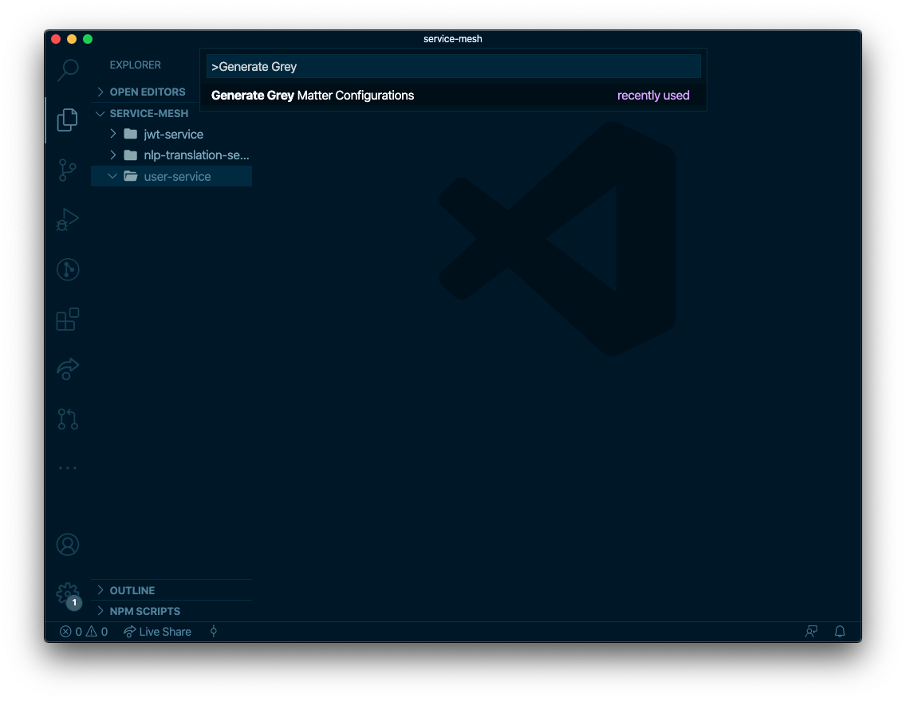

# vscode-greymatter

The Grey Matter VSCode extension provides user shortcuts to generate configuration files for a Grey Matter based service mesh.

> Note: This extension is not entirely standalone as it is a companion tool to the Grey Matter CLI. If you would like a demo or to learn more about Grey Matter pricing, please reach out to us at [info@greymatter.io](mailto:info@greymatter.io).

## Prerequisites

- `greymatter` CLI version 2.x installed in your PATH
- Template source such as [pathogen-greymatter](https://github.com/greymatter-io/pathogen-greymatter)

## Usage Instructions

1. Open the command palette (Ctrl+Shift+P on Windows and Linux, Cmd+Shift+P on OS X) and search for Grey Matter. Alternatively, you can right click on any folder in the Explorer.

2. Select "Generate Grey Matter Configurations"

3. Enter the template source URL, e.g. `git@github.com:greymatter-io/pathogen-greymatter.git//service`. The extension will remember template sources previously used within the workspace.

4. Answer the prompts for template values. Once all variables have been resolved, the resulting configuration files will be written to the current workspace directory, or a folder if the extension was invoked from the context menu.